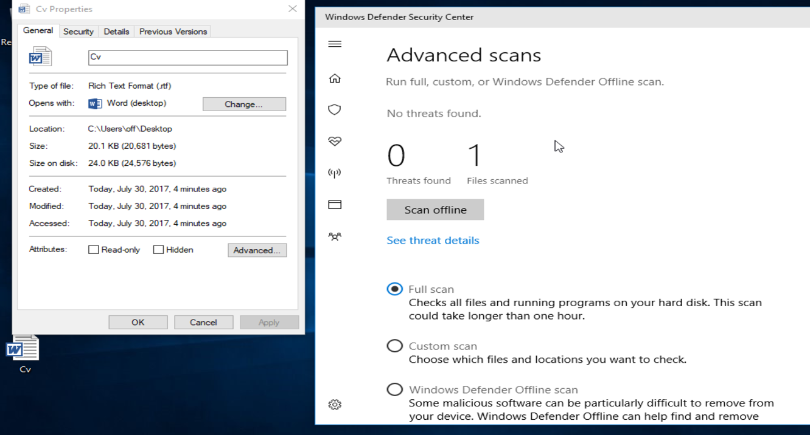

# Iris
# Description
Iris is an adjudicational Trojan & a fullon RootKit, Targeting windows machine's, maid for Research purposes 
And as a resource Kit for ethical hackers.
we begin with delivery methods, anti-virus evastion and continue on to local acceleration of privileges in order to get a privileged persistent on the target machine. in this Repo we will try to simulate a full on root-kit throw hiding our persistence mechanism of action and simulating a real targeted campaign against any company or retailer.
i do not supply any binary's for any of the Rat components, nither forge certificate's or native executable's.
on the other hand i will try to give as much information as possible on how to avoid getting hit by this kind of exploit, and ll' try to supply as many open resources as possible to implement your own tool, for ethical hacking purposes, and for anti-virus software writers.
# Tech
# Packing:
this specific Kit is implemented as such to simulate a targeted campaign against a retaler or a comapny assuming that the company use default office product's. becouse of that, our main delivery method for this kit is throw the office api, i implement the payload as an rtf document but this can easily be deployed to any other type of document (s.t, xls, .doc etc..). i implement this specific payload as it do not requere any former preperation on the client side, and it is not recognized as a malware by the google mail (afaik), or most modern Av products.
in addition i will say that getting a Cv for a job application in the form of an rtf is an everyday harmless way to pack your payload, and any un-paranoid HR-person will likely to open the given document, in addition the mail display is not implemented on rtf as to .pdf documents in many browsers and mail providers, so its a good enough reason to download the document and to view it on the local machine.
# Spec: view delivery section under the /src directory.
# Delivery

# Av
# No threats detected & No FireWall Block or user interactions.

# Persistence
# No Registry

# Not Operating From User Land & and the user don't need to be the domain admin.

